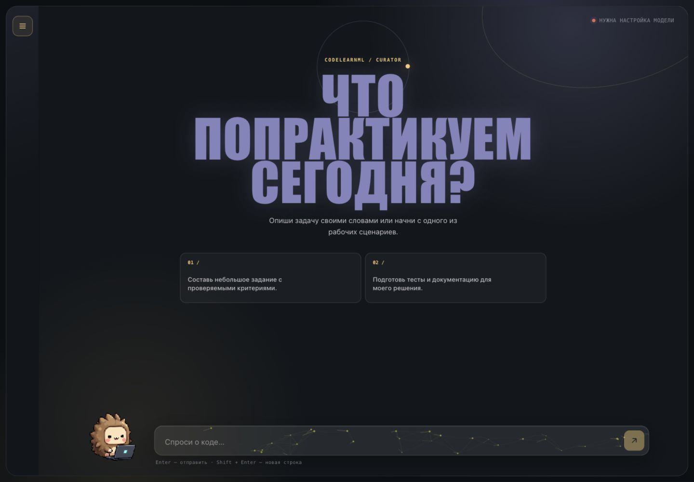
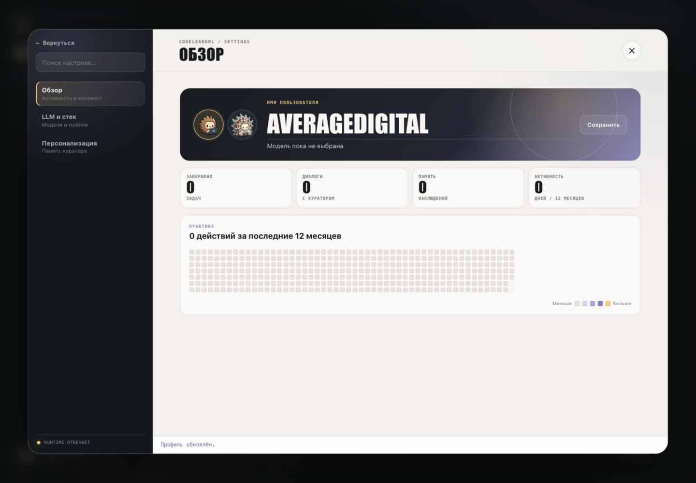

# CodeLearnML

Локальный trainer по коду (ЛЛМ стек)


## Интерфейс

### Чат с LLM-куратором



### Профиль и активность



## Стек

- Frontend: React 19, Vite.
- Backend: Node.js.
- Хранилище: SQLite.
- Опциональная graph memory service: Python 3.12, FalkorDB.


## Требования

- Node.js 22+.
- npm.
- Python 3.12+ для `tests/memory-service-check.py` и опционального memory service.
- Docker для container/runtime workflows.

## Установка

```sh
npm install
```


Основные переменные:

- `OPENAI_API_KEY`, `OPENAI_ADMIN_KEY`, `OPENROUTER_API_KEY`, `YANDEX_AI_STUDIO_API_KEY` - ключи провайдеров, используются только backend.
- `YANDEX_AI_STUDIO_FOLDER_ID` - нужен для Yandex AI Studio.
- `CODELEARN_ENV_PATH` - локальный env-файл, который обновляет Settings API. По умолчанию `./.env`.
- `CODELEARN_DB_PATH` - путь к SQLite. По умолчанию `./data/codelearn.sqlite`.
- `CODELEARN_SEED_DEV_DATA` - `true` только для локального bootstrap.
- `JUDGE0_BASE_URL` - внешний sandbox endpoint для `/api/execute`.
- `GRAPH_MEMORY_URL` - URL опционального graph memory service.
- `WORKSPACE_RUNTIME_URL`, `AGENT_RUNTIME_URL` - URL опционального workspace и agent runtime.


## Локальный запуск

Frontend dev server:

```sh
npm run dev
```

Backend:

```sh
npm run build
npm run server
```

Backend URL по умолчанию:

```text
http://127.0.0.1:4173
```

## Docker

```sh
docker build -t codelearn .
docker run --rm -p 4173:4173 -v codelearn-data:/data -v codelearn-workspace:/app/workspace codelearn
```

Container хранит runtime `.env`, SQLite data и personality memory в `/data`.

## Опциональные runtime services

Workspace и agent runtime:

```sh
npm run runtime:workspace
```

Изолированный runtime для одной задачи:

```sh
CODELEARN_PROJECT_ID=task-id npm run runtime:project
```

Graph memory runtime:

```sh
npm run runtime:memory
```

Все runtime services:

```sh
npm run runtime:all
```

Остановка runtime services:

```sh
npm run runtime:down
```

## Проверки

```sh
npm test
npm run build
```

## Основные API

- `GET /api/app-state` - текущий урок, задачи, progress, settings, memory и runtime state.
- `POST /api/lessons` - импорт JSON-спеки урока из ответа ЛЛМ и создание workspace-файлов задачи.
- `PATCH /api/tasks/:id/progress` - сохранение draft-кода и индекса подсказки.
- `GET /api/tasks/:id/log` - история запусков задачи и assigned markdown.
- `POST /api/tasks/:id/runs` - сохранение результата запуска задачи.
- `GET /api/workspace/tasks/:taskId/files` - список workspace-файлов задачи.
- `GET /api/workspace/tasks/:taskId/files/:path` - чтение workspace-файла задачи.
- `GET|PATCH /api/workspace/tasks/:taskId/agent/files/:path` - чтение/запись agent-scoped файлов задачи.
- `POST /api/workspace/tasks/:taskId/agent/run` - передача команды во внешний agent runtime.
- `GET|POST /api/memory/events` - чтение/создание memory review events.
- `PATCH /api/memory/events/:id` - обновление review status memory event.
- `POST /api/memory/graph-sync` - синхронизация accepted memory events в graph memory service.
- `POST /api/memory/graph-search` - запрос к graph memory service.
- `GET /api/runtime/health` - проверка опциональных runtime integrations.
- `POST /api/execute` - запуск кода через Judge0-compatible sandbox.
- `POST /api/models` - proxy для списка моделей провайдера.
- `POST /api/responses` - proxy для LLM requests.
- `GET|POST|DELETE /api/personality` - управление markdown personality memory.
