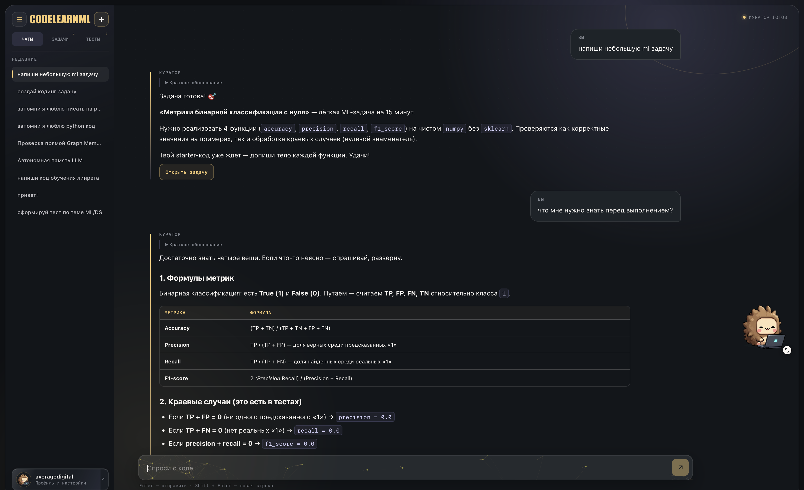
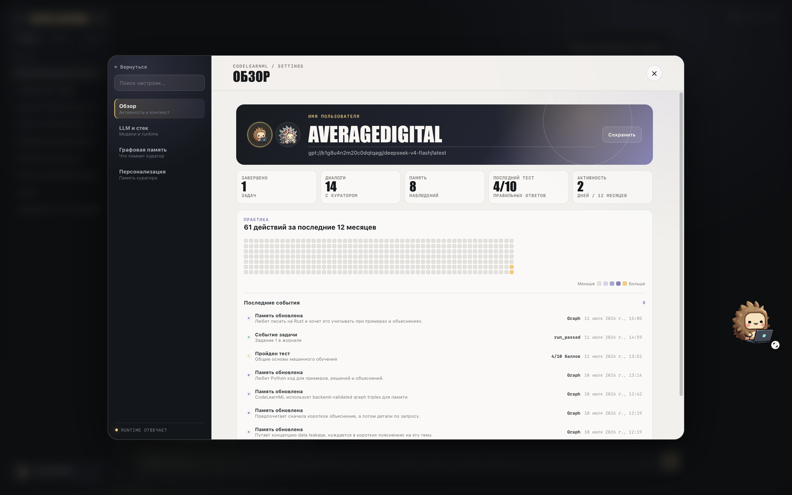
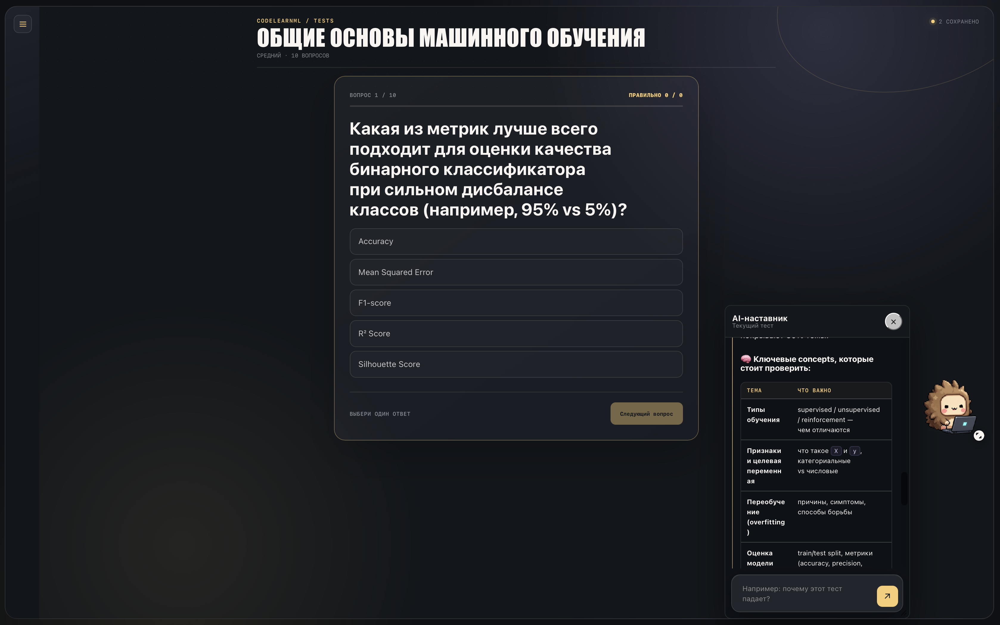
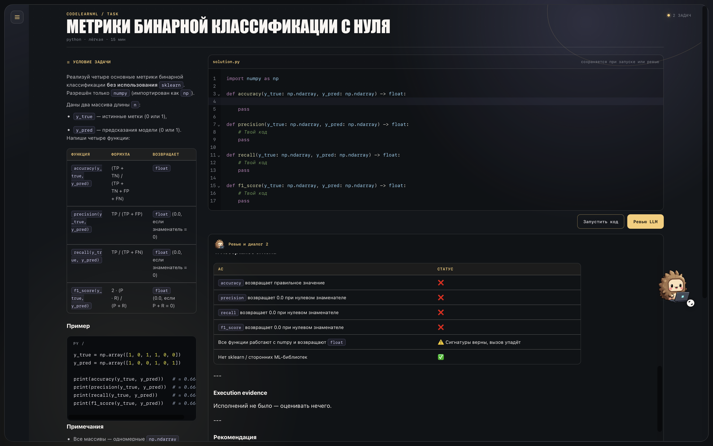

# CodeLearnML

Локальный тренажёр программирования с LLM-куратором, тестами, coding-задачами и графовой памятью.


## Интерфейс

### Чат



### Активность



### Тесты



### Задачи



## Возможности

- чат с LLM-провайдерами;
- генерация уроков, тестов и coding-задач;
- выполнение Python и JavaScript в локальном Judge0 CE;
- LLM-ревью решений;
- локальная история и графовая память.

## Требования

- Node.js 22+ и npm;
- Docker;
- Python 3.12+ для проверки Graph Memory.

## Запуск

```sh
git clone https://github.com/averagedigital/learnloop-code.git
cd learnloop-code
cp .env.example .env
npm start
```

`npm start` установит Node.js-зависимости, соберёт frontend, поднимет FalkorDB, Graph Memory и локальный Judge0 с PostgreSQL и Redis, затем запустит приложение на [http://127.0.0.1:4173](http://127.0.0.1:4173).

Первый запуск скачивает Docker-образы. Judge0 на Apple Silicon работает через эмуляцию `linux/amd64`.

## Настройка LLM

Укажите в `.env` ключ и модель нужного провайдера:

- OpenAI: `OPENAI_API_KEY`, `OPENAI_MODEL`;
- OpenRouter: `OPENROUTER_API_KEY`, `OPENROUTER_MODEL`;
- Yandex AI Studio: `YANDEX_AI_STUDIO_API_KEY`, `YANDEX_AI_STUDIO_FOLDER_ID`, `YANDEX_AI_STUDIO_MODEL`.

Ключи используются только backend. Полный список параметров находится в [`.env.example`](.env.example).

## Команды

```sh
npm test          # тесты
npm run build     # production-сборка
npm run dev       # frontend для разработки
npm run server    # собранное приложение без запуска Docker-сервисов
npm run runtime:all
npm run runtime:down
```

Runtime API:

- приложение: `http://127.0.0.1:4173`;
- Judge0: `http://127.0.0.1:2358`;
- Graph Memory: `http://127.0.0.1:8008`;
- health: `GET /api/runtime/health`.

Сервисы по умолчанию публикуются только на `127.0.0.1`.

## Хранение данных

- SQLite: `./data/codelearn.sqlite`;
- workspace задач: `./workspace`;
- настройки и ключи: `./.env`;
- FalkorDB и Judge0 PostgreSQL: Docker volumes.

## Благодарности

- [CodeMirror](https://github.com/codemirror/dev) — редактор кода;
- [Judge0 CE](https://github.com/judge0/judge0) — выполнение кода;
- [FalkorDB](https://github.com/FalkorDB/FalkorDB) — графовая память.

Условия использования зависимостей приведены в [THIRD_PARTY_NOTICES.md](THIRD_PARTY_NOTICES.md).

## Лицензия

[MIT](LICENSE)
